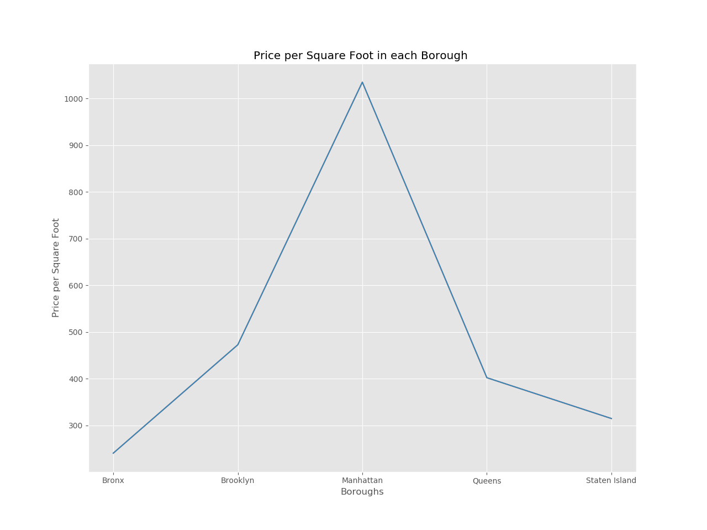
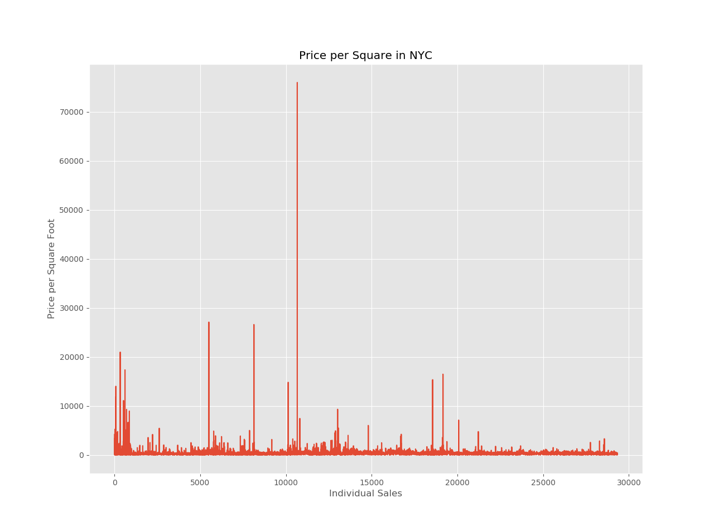
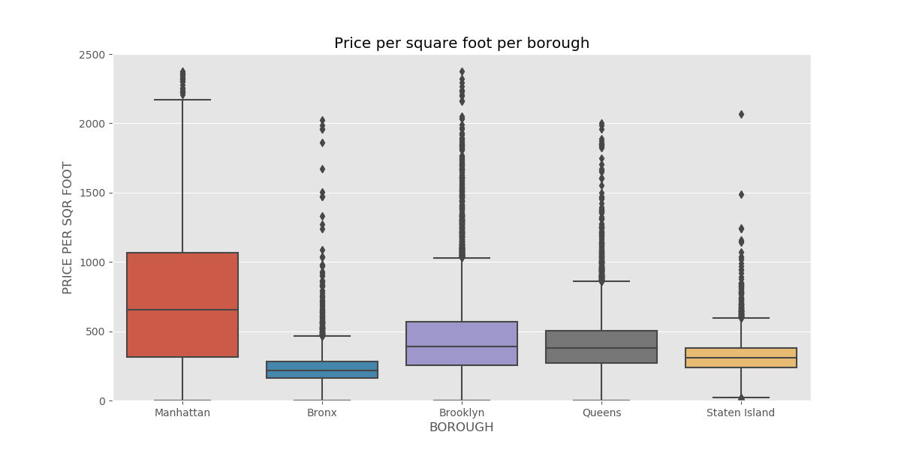

# Capstone 1
## Introduction
As someone who is interested in real-estate inveting I wanted to create a framework for a city that would make show overvalued and undervalued properties within a specific city. I chose New York City for my analysis.
### About The Data
The data set that I chose is a data set that shows the buildings or building usits sold in the New York City property market over a 12-month period. The main columns that I used in my anaysis was the Borough, sale price, and gross square feet. 

First thing that I did was clean the data and create some new columns to create some new metrics and increase readability. I created a price per square foot column. I also seperated the sales sate column into a day,month and year column. 

I then anayzed the overal price per square foot between the seperate boroughs of NYC which is shown in the graph below. If  anyone knows anything about NYC then this graph should make sence. With Manhattan's average being the highest, the Bronx and Staten Island being the lowest and Boorklyn and Queens being right in the middle. 

    

After seeing the mean price per Borough I wanted to visualize all of the individual sales to see if therer was a visual pattern to follow or any main outliers what I could see. It turns that that There were some major outliers.

    

After I saw the extreme outliers in the overvaluation of some properties I wanted to do some investigating in the reasons behind the sales. The first two images that are shown below are the top two outliers that I saw. The first one is a lot that is going to be constructed into a large storage facility.The second image is the details behind the second outlier. The building is a new aparemtnet development with very high rent because of the location and quality of the aparemtments.   

    

    

The last image is an example of the the properties that are sold at an extremely low price because of a special program that NYC does that will be explained below the image itself.

    

### One dolar sales
"The City of New York has a tradition of selling unused property for one dollar to incentivize development, encourage nonprofit developers to apply for the lots, and free the city of maintenance costs. Developers are required to submit specific housing plans for the property and need to show that they have the funds to execute. New York City’s Department of Housing Preservation and Development sold 700 buildings for a dollar between 2002 and 2006, though the pace has decreased considerably since then as the city’s stock of ownership has declined." -NYU Furman Center 

After analyzing the high outliers and low values I figured to get a bette snapshot of the data a should get rid of any outliers.I then made a boxplot of the data again grouped by the five Boroughs. When looking at the boxplot I noteiced a few things. If I wanted to invest in a property in Manhattan I would want to look at a prperty that comes in the 25% percentile because it is still in the centeral range of the Manhatan properties but has a lot of room for improvment because of the large variance. 

    

    
| Borough | STD |
|-------|---|
|Bronx|204.27|
|Brooklyn|991.02|
|Manhattan|1465.20|
|Queens|321.18|
|Staten Island|153.95|

## Conclusion
The interesting part that makes real estate investing so attractive to me is the different strategies that you can take when finding properties. For instance If I were to invest given this information (which is not enough information to be making financial decisions on) I would want to invest in a Manhatan prperty that comes in around $400 per square feet. But if someone else were to see this data they may want to invest in a property in the Bronx because is has the lowest standard deviation and the lowest cost of entry so someone can assume that they really know what they're getting out of a propety. Once again, the amount of metrics found in this data just is not enough to find a meaningful stategy in which to base any kind of investment off of. But you can definately understand a poor investment when you see when if they are out of the ranges provided in the boxplot above and when outside of that range use this as a negotiation tool to lower down the initial offers. 
### Bibliography
“One Dollar Lot Sales – Directory of NYC Housing Programs.” NYU Furman Center, furmancenter.org/coredata/directory/entry/one-dollar-lot-sales. 
